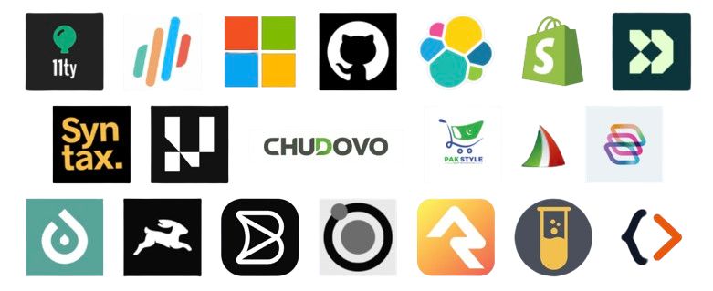
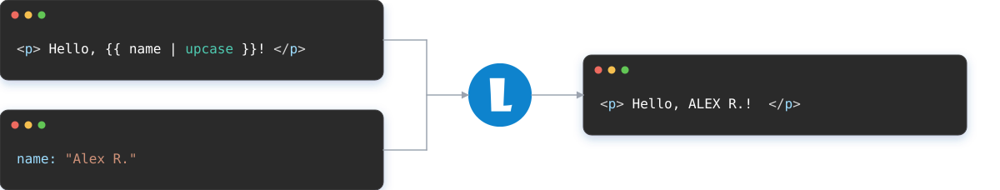
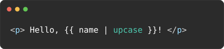
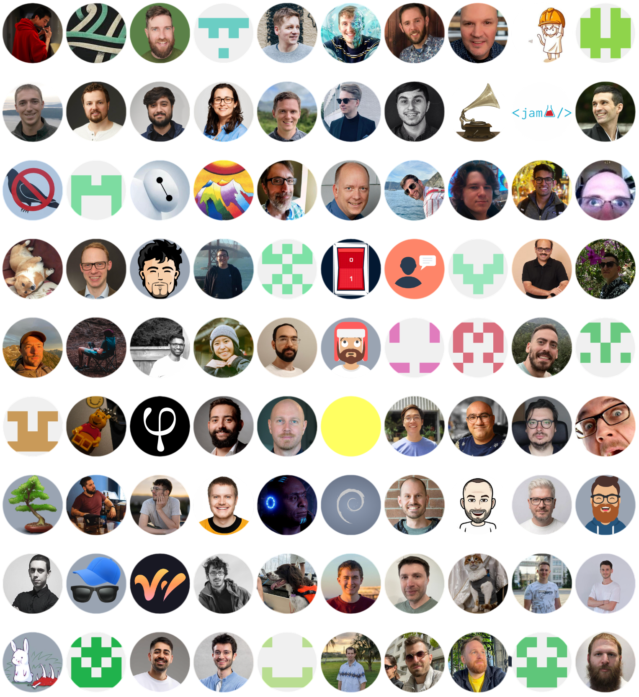

<!--
marp: true
theme: liquidjs
title: "LiquidJS: Building a template engine and growing an open source project"
_header: ''
paginate: false
-->

<style>@import 'styles.css';</style>

<div class="brand">

<h1>LiquidJS</h1>
</div>

### Building a template engine and growing an open source project

Yang Jun

---

<!-- _class: speaker -->
<div class="speaker">
<div class="speaker-photo">

</div>
<div class="speaker-bio">

# About Me

My name is [Yang Jun](https://www.linkedin.com/in/harttle). I have worked as an engineer and architect at companies including Baidu, Microsoft, TikTok, and Airwallex.

And I'm the creator and maintainer of the **LiquidJS** template engine.

</div>
</div>

---

# Today

1. **What LiquidJS is** — what it is and who uses it
2. **How LiquidJS works** — parsing, rendering, and the render flow
3. **Maintaining an open source library** — what it's like to maintain a project

---

<!-- paginate: true -->
<!-- _class: section-start -->
<div class="section-start">
<div class="section-start-image">


</div>
<div class="section-start-content">

# Part 1

## What is LiquidJS?

</div>
</div>

---

# A brief history of Web rendering

The Web didn't start with React.

| Era             | Common approach                         | Mental model                                |
| --------------- | --------------------------------------- | ------------------------------------------- |
| **1990s**       | Static HTML → server-side scripting     | Documents → **dynamic pages**               |
| **2000s**       | PHP / Rails / Django + template engines | **Data-driven HTML** / MVC                  |
| **2010s** | Node.js + JS templates + AJAX / jQuery  | Data-driven HTML + **rich interaction**     |
| **Since then**  | React / Angular / Vue                   | Data-driven **interactive UI** / components |

LiquidJS is one of the JS template engines.

---

<!-- _class: template-engine template-engine-spaced -->
<style>
section.template-engine-spaced h1 {
  margin-bottom: 2rem;
}
</style>

# Template engines made simple



---

# Template engines vs. reactive UI frameworks

Template engines and reactive frameworks may both use templates, but they solve different problems:

| | Template engine | Reactive UI framework |
| --- | --- | --- |
| **Main job** | Turn a template and data into a document | Keep the DOM tree in sync with state |
| **Output** | HTML, email, text, or generated source code | An interactive user interface |
| **Best fit** | Content is rendered once for a given data | The interface changes as users interact with it |

---

# How are template engines different?

| Engine | Style | Logic | Best for |
|---|---|---|---|
| **EJS** | `<%= value %>` / `<% code %>` | Full JS | Straightforward server-rendered pages in Express |
| **Handlebars** | `{{value}}` / `{{#block}}` | Helpers only | Shared templates with explicit helpers |
| **Mustache** | `{{value}}` / `{{#section}}` | Logic-less | Portable templates across languages and runtimes |
| **LiquidJS** | `{{value}}` / `` | Tags + filters | Shopify- and Jekyll-compatible templates in JavaScript |
| **Nunjucks** | `{{value}}` / `` | Rich template logic | Content-heavy sites with inheritance and macros |

Different engines make different trade-offs, especially between power and safety.

---

<!-- _class: language-overview -->
<!-- _style: --grammar-code-size: 14px; --grammar-code-line-height: 1.5 -->

# The Liquid Language

Liquid is a **template language** originally defined by Shopify and implemented in Ruby.

- Adopted by Jekyll, the Ruby static site generator
- Supported by GitHub Pages, which builds Jekyll sites

The syntax is straightforward while remaining expressive enough.

```liquid
<h2>{{ product.title | upcase }}</h2>


  <p>{{ product.price }}</p>
  <button>Add to cart</button>

  <p>{{ product.title }} is sold out.</p>

```

---

# LiquidJS

**LiquidJS = Liquid for JavaScript**

A JavaScript implementation of the Liquid language.

```js
import { Liquid } from 'liquidjs'

const engine = new Liquid()

await engine.parseAndRender(
  'Hello, {{ name | capitalize }}!',
  { name: 'liquid' }
)

// → Hello, Liquid!
```

---

# Use cases

| Use case | How teams use it |
| --- | --- |
| **Eleventy** | LiquidJS is the default template engine of this site generator |
| **Kibana** | Workflow YAML uses Liquid expressions to interpolate inputs and transform values with filters |
| **GitHub Docs** | Documentation content uses LiquidJS with custom tags |
| **C++ code generation** | Generate source files from templates—LiquidJS is HTML-agnostic |
| **OpenSense** | Compose and send personalized email content from Liquid templates |

For more details, check [liquidjs.com](https://liquidjs.com/) and [harttle/liquidjs/network/dependents](https://github.com/harttle/liquidjs/network/dependents)

---

<!-- _class: section-start -->
<div class="section-start">
<div class="section-start-image">


</div>
<div class="section-start-content">

# Part 2

## How LiquidJS works

</div>
</div>

---

<!-- _class: template-engine -->

# Template + Data → HTML


---

# Process breakdown

Combine a template with its data context to produce output—typically an HTML string.

| Step | What happens |
| --- | --- |
| **1. Parse** | [`Liquid.parse()`](https://github.com/harttle/liquidjs/blob/master/src/liquid.ts) turns source text into `Template[]` objects: HTML, output, and tag nodes |
| **2. Walk the Template[]** | [`Render.renderTemplates()`](https://github.com/harttle/liquidjs/blob/master/src/render/render.ts) calls `render(ctx, emitter)` for each node in source order |
| **3. Evaluate** | Output the value of each node given context, running filters and tags at the same time |

---

<!-- _class: grid -->
# Parse: template → AST

<div class="grid-row">
<div class="grid-col border-right-dotted">

Source template:

```liquid
Hello, {{ name | capitalize }}!
```

Grammar:

```bnf
<template>   ::= <template> <text> | <template> <output> | ""
<output>     ::= "{{" <expression> "}}"
<expression> ::= <identifier> | <identifier> "|" <filter>
```

</div>

<div class="grid-col">

Result AST (Abstract Syntax Tree):

```text
Template
├── Text("Hello, ")
├── Output
│   ├── Identifier("name")
│   └── Filter("capitalize")
└── Text("!")
```

</div>

</div>

<div class="row">

The same parsed template can render repeatedly with different input data.

</div>

---

# Parser implementation: in theory

Context-free grammars can be parsed with stack-based algorithms. CodeMirror's Lezer generates an LR parser from a grammar. For example, its Liquid grammar:

```bnf
Interpolation { interpolationStart expression Filter* interpolationEnd }
Tag { tagStart (TagName expression? Filter*)? tagEnd }
forTag[@name=Tag] { tagStart tagName<"for"> VariableName kwx<"in"> expression Parameter* tagEnd }
tablerowTag[@name=Tag] { tagStart tagName<"tablerow"> VariableName kwx<"in"> expression Parameter* tagEnd }
cycleTag[@name=Tag] { tagStart tagName<"cycle"> (StringLiteral ":")? StringLiteral ("," StringLiteral)* tagEnd }
echoTag[@name=Tag] { tagStart tagName<"echo"> expression Filter* tagEnd }
assignTag[@name=Tag] { tagStart tagName<"assign"> expression Filter* tagEnd }
renderTag[@name=Tag] { tagStart tagName<"render"> expression RenderParameter* tagEnd }
liquidTag[@name=Tag] { tagStart tagName<"liquid"> liquidDirective* tagEnd }
Parameter { ParameterName { identifier } (":" expression)? }
endcommentTag[@name=EndTag] { endcommentTagStart tagName<"endcomment"> tagEnd }
endrawTag[@name=EndTag] { endrawTagStart tagName<"endraw"> tagEnd }
RenderParameter { "," VariableName ":" expression | (kwx<"with"> | kwx<"for">) expression (kwx<"as"> VariableName)? }
```

Liquid definition in CodeMirror: <https://code.haverbeke.berlin/codemirror/lang-liquid>

---

# Parser implementation: in practice

Production parsers are often tailored to a specific purpose.

- In LiquidJS, the parser uses depth-first string traversal rather than a state machine.
- It uses recursion and backtracking thus it's not `O(n)` complexity.

| System | Approach | Source |
| --- | --- | --- |
| **LiquidJS** | Tokenizer + hand-written parser → renderable `Template[]` | [Tokenizer](https://github.com/harttle/liquidjs/blob/master/src/parser/tokenizer.ts) · [Parser](https://github.com/harttle/liquidjs/blob/master/src/parser/parser.ts) |
| **Vue** | Tokenizer + hand-written parser → compiler AST | [parser.ts](https://github.com/vuejs/core/blob/main/packages/compiler-core/src/parser.ts) |
| **Babel / JSX** | Token stream + hand-written parser → transform AST | [babel-parser](https://github.com/babel/babel/tree/main/packages/babel-parser) |

The result is an AST representing the template string.

---

# Render: AST + data → HTML

Rendering uses input data as context, traverses the AST, and emits values along the way. In practice, it is more involved:

- Tags and filters, especially registered custom tags and filters
- Scope stack maintenance, somewhat like a call stack
- Other features: expression evaluation, streaming, async rendering, isolation, etc.

---

<!-- _class: grid -->
# Recap: the whole render flow

<div class="grid-row">
<div class="grid-col border-right-dotted">

Source template

```liquid
Hello, {{ name | capitalize }}!
```

</div>
<div class="grid-col border-right-dotted">

AST

```text
Template
├── Text("Hello, ")
├── Output
│   ├── Identifier("name")
│   └── Filter("capitalize")
└── Text("!")
```

Data

```json
{ "name": "liquid" }
```

</div>
<div class="grid-col">

Result HTML

```html
Hello, Liquid!
```

</div>
</div>

---

<!-- _class: section-start -->
<div class="section-start">
<div class="section-start-image"></div>
<div class="section-start-content">

# Part 3

## Maintaining an open source library

</div>
</div>

---

# Maintenance is a feedback loop

Every issue points to functionality somebody depends on.

| Signal | Ask | Action |
| --- | --- | --- |
| Something broken | Is this intended behavior? Can it be fixed without a breaking change? | Regression test / limitation note / bug fix / future plan |
| Something needed | Is it within the project's scope? Is it feasible? Would it be breaking? | Feature patch / won't-do decision / open discussion / future plan |
| Help needed | Is documentation missing? Can the user achieve it? Is the feature easy to use? | Documentation update / limitation note / code change |
| Vulnerability report | Is this intended behavior? Does the design need reconsidering? | Limitation note / fix and rollout / feature removal |

---

# Community shapes the library

When we build a useful project, document it well, and follow the feedback loop, the community gradually shapes it into something production-ready.

- The design and implementation are very different from the initial version.
- By August 2026, LiquidJS had [93 contributors](https://github.com/harttle/liquidjs/graphs/contributors).
- The repository has recorded [405 pull requests](https://github.com/harttle/liquidjs/pulls?q=is%3Apr) and [418 issues](https://github.com/harttle/liquidjs/issues?q=is%3Aissue); it has [281 forks](https://github.com/harttle/liquidjs/forks).

The maintainer's job is to protect the project's purpose and boundaries.

---

# The timeline of LiquidJS

| Date | Milestone |
| --- | --- |
| **Jun 14, 2016** | First npm release: `shopify-liquid@1.0.0` |
| **Jun 23, 2016** | First GitHub issue: a request for `layout`, `include`, and `block` support |
| **Sep 12, 2016** | First community pull request: an async rendering experiment |
| **Feb 26, 2020** | First sponsor from Open Collective: Dropkiq |
| **Jan 26, 2026** | Reached 1M weekly npm downloads |
| **Aug 20, 2026** | 1.7M weekly downloads, 627 npm dependents, 93 contributors, 20 sponsors |

---

# What helped adoption?

**Keeping it reliable**

- Stay compatible with **Shopify Liquid** and **Jekyll** wherever possible
- Invest in **testing** — LiquidJS now has 1,640 test cases

**Making it developer-friendly**

- Built-in **TypeScript** types, clear [documentation](https://liquidjs.com) and interactive [demos](https://liquidjs.com/playground.html)
- Flexible **distribution options** — Node.js, browser bundle, and CLI

---

# How AI changes maintenance

- **More security reports.** AI makes large-scale analysis feasible for security researchers.
- **More pull requests.** With agents, code style and testing are no longer the main concern.

**The bottleneck shifts to maintainers:** understanding the bug reports, the change sets, the impact of a change on the overall design, future plan and security model.

---

<!-- _class: thank-you -->

<div class="thank-you">
<div class="thank-you-hero">

<h1>Thank you</h1>
<p class="thank-you-questions">Questions?</p>
</div>
<div class="thank-you-panel">
<div class="thank-you-section">
<h2>Project</h2>
<a href="https://liquidjs.com">liquidjs.com</a>
<a href="https://github.com/harttle/liquidjs">github.com/harttle/liquidjs</a>
<a href="https://www.npmjs.com/package/liquidjs">npmjs.com/package/liquidjs</a>
</div>
<div class="thank-you-section">
<h2>Support</h2>
<a href="https://github.com/sponsors/harttle">github.com/sponsors/harttle</a>
<a href="https://opencollective.com/liquidjs">opencollective.com/liquidjs</a>
</div>
</div>
</div>

<!-- Q&A. Mention playground and docs for anyone who wants to try it. -->

---


