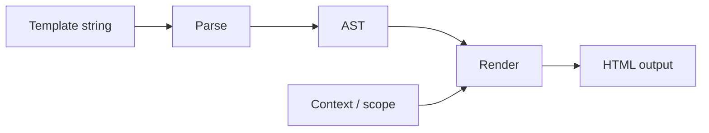

<!--
marp: true
theme: liquidjs
_header: ''
paginate: true
-->

<style>@import 'styles.css';</style>

<div class="brand">

<h1>LiquidJS</h1>
</div>

### Building a template engine and growing an open source project

Yang Jun

---

<!-- _class: speaker -->
<div class="speaker">
<div class="speaker-photo">

</div>
<div class="speaker-bio">

# About Me

My name is [Yang Jun](https://www.linkedin.com/in/harttle/), I have degrees in **Physics** and **Computer Science** and has worked as engineer and architect at **Microsoft**, **TikTok**, etc.

And I'm the creator and maintainer of the **LiquidJS** template engine.

</div>
</div>

---

# Today

1. **What is LiquidJS** — the language, the library, a quick start
2. **Use cases** — who uses it and why
3. **How LiquidJS works** — parse, render, design choices
4. **Maintaining an open source library** — community, scale, sustainability

---

<!-- _class: section-start -->
<div class="section-start">
<div class="section-start-image">


</div>
<div class="section-start-content">

# Part 1

## What is LiquidJS

</div>
</div>

---

# What is LiquidJS?

The Web didn't start with React.

| Era             | Common approach                         | Mental model                                |
| --------------- | --------------------------------------- | ------------------------------------------- |
| **1990s**       | Static HTML → server-side scripting     | Documents → **dynamic pages**               |
| **2000s**       | PHP / Rails / Django + template engines | **Data-driven HTML** / MVC                  |
| **Early 2010s** | Node.js + JS templates + AJAX / jQuery  | Data-driven HTML + **rich interaction**     |
| **Late 2010s**  | React / Angular / Vue                   | Data-driven **interactive UI** / components |
| **2020s**       | React / Vue + SSR / SSG / hydration     | Interactive UI + **server rendering**       |


LiquidJS is one of the JS template engines.

---

<!-- _class: template-engine -->

# What Is a Template Engine?


---

# How Are Template Engines Different?

They all do: **Template + Data → HTML**

The differences are mainly about **how much power the template has** and **how it connects to the application**.

| | Liquid | Jinja | ERB | Handlebars |
| --- | --- | --- | --- | --- |
| **Logic** | Limited | Rich | Full host language | Limited |
| **Code access** | Sandboxed | Sandboxed* | Ruby | Sandboxed |
| **Extensibility** | Filters / Tags | Filters / Tests / Macros | Ruby methods | Helpers / Partials |
| **Data model** | Drops / objects | Python objects | Ruby objects | JSON-like objects |
| **Typical ecosystem** | Shopify / Jekyll | Python | Rails / Ruby | JavaScript / Node.js |
| **Strength** | Safety & portability | Flexibility | Maximum power | Simplicity |

\* Jinja can be sandboxed, but its security depends on configuration.

### The key trade-off

**More power** ←──────────────→ **More isolation**

`ERB` lets templates get very close to the application.

`Liquid` deliberately keeps templates further away from the application.

That's why **Liquid can safely let someone else write the template**.

# Liquid

Liquid is a **template language created by Shopify**.

```liquid
<h1>{{ product.title }}</h1>


  <button>Add to cart</button>

```

It lets applications expose data and presentation logic
while keeping templates **simple and sandboxed**.

Used by:

**Shopify themes · Jekyll · other tools**

Liquid isn't React.

It solves a different problem:

> **Generate a document from data.**

---

# LiquidJS

**LiquidJS = Liquid for JavaScript**

A JavaScript implementation of the Liquid language.

```js
import { Liquid } from 'liquidjs'

const engine = new Liquid()

await engine.parseAndRender(
  'Hello, {{ name | capitalize }}!',
  { name: 'liquid' }
)

// → Hello, Liquid!
```

Runs in:

**Node.js · Browser · CLI**

So a language created for the pre-React web
can still run inside today's JavaScript ecosystem.

---

<!-- _class: section-start -->
<div class="section-start">
<div class="section-start-image"></div>
<div class="section-start-content">

# Part 2

## Use cases

</div>
</div>

---

# Start with a real gap

LiquidJS filled a concrete need:

- Ruby Liquid existed; **JavaScript did not**
- Teams migrating from Jekyll / GitHub Pages needed a faithful port
- Shopify theme tooling increasingly touched the JS ecosystem

**Lesson:** widely used libraries solve **migration and interoperability** pain.

---

# Compatibility as a strategy

- Follow the **reference implementation** closely
- Invest in **regression tests** against real-world templates
- Treat breaking changes as a **last resort**
- Document **differences** honestly when they exist

<!-- Users choose you because their existing templates keep working. -->

---

# Developer experience

What helped adoption:

- Clear **[documentation](https://liquidjs.com)** and tutorials
- **[Playground](https://liquidjs.com/playground.html)** for quick experiments
- **TypeScript** types out of the box
- Simple API: `parseAndRender`, partials, layouts, caching

---

# Quality guardrails

- **CI** on every change
- **High test coverage** — edge cases from Shopify & Jekyll matter
- **Semantic versioning** — predictable upgrades for dependents
- **Multiple runtimes** — Node.js, browser bundle, CLI

---

# Ecosystem adoption

LiquidJS is used across static sites, e-commerce, email, CMS, and more.

Products and teams have built on it — see the [Used by](https://github.com/harttle/liquidjs#used-by) list on GitHub.

**Takeaway:** a library grows when it becomes **infrastructure**, not just a utility.

---

<!-- _class: section-start -->
<div class="section-start">
<div class="section-start-image"></div>
<div class="section-start-content">

# Part 3

## How LiquidJS works

</div>
</div>

---

# Template → HTML pipeline



<!-- Parse once, render many times. Caching the AST is a big win. -->

---

# How Is a Template Language Defined?

A language needs a **grammar** — rules for what is valid.

```bnf
<template> ::= <text> | <output> | <template> <output>
<output>   ::= "{{" <expression> "}}"
<expression> ::= <identifier> | <identifier> "|" <filter>
```

```liquid
Hello, {{ name | capitalize }}!
```

---

# Parse: template → AST

**Source → Tokens → Parser → AST**

```text
Template
├── Text("Hello, ")
├── Output
│   └── Filter
│       └── Variable("name")
└── Text("!")
```

**Tags** — control flow and structure

```liquid

  Welcome, {{ user.name }}

  Please sign in

```

**Filters** — transform output (`capitalize`, `date`, `json`, …)

---

# Render: AST + context → HTML

| Concept | Role |
|--------|------|
| **Context** | Variables available to the template |
| **Scope** | Nested contexts inside `for`, `capture`, … |
| **Partials & layouts** | Reusable fragments and page shells |
| **Tags & filters** | Built-in + custom extensions |

---

# From grammar to parser

A **grammar** is the spec. A **parser** is the implementation.

**Tokenize** → **parse** → **AST**

```bnf
@top Template { element* }
element { Text | Interpolation | directive }
Interpolation { "{{" expression Filter* "}}" }
Filter { "|" identifier }
```

```liquid
Hello, {{ name | capitalize }}!
```

The same pipeline powers rendering — and other use cases (highlighting, linting, …).

---

# How production parsers work

Template **engines** need a semantic AST for rendering.

| System | Approach | Source |
| --- | --- | --- |
| **LiquidJS** | Tokenizer + hand-written recursive descent | [Tokenizer](https://github.com/harttle/liquidjs/blob/master/src/parser/tokenizer.ts) · [Parser](https://github.com/harttle/liquidjs/blob/master/src/parser/parser.ts) |
| **Vue** | Hand-written template parser → AST | [parser.ts](https://github.com/vuejs/core/blob/main/packages/compiler-core/src/parser.ts) |
| **Babel / JSX** | Hand-written JavaScript parser → AST | [babel-parser](https://github.com/babel/babel/tree/main/packages/babel-parser) |

**Unlike grammar-driven parsers:**

- **Recursive descent** (DFS) — imperative code walks the input, not a generated LR/CFG table
- **Not** declarative BNF — you encode precedence, whitespace, and edge cases directly
- Built for **correctness & execution**; editors need **incremental, error-tolerant** parsing instead ([Lezer design notes](https://marijnhaverbeke.nl/blog/lezer.html))

---

# Design choices

- **Compatibility first** — match Shopify / Jekyll behavior
- **Safety by default** — templates cannot run arbitrary JS
- **Extensibility** — register custom tags and filters
- **Isomorphic** — same engine in Node.js and the browser

<!-- Compatibility creates trust. Trust creates adoption. -->

---

<!-- _class: section-start -->
<div class="section-start">
<div class="section-start-image"></div>
<div class="section-start-content">

# Part 4

## Maintaining an open source library

</div>
</div>

---

# The question

> What happens when a small open-source project becomes software that **thousands of projects depend on**?

---

# From side project to dependency

The shift when usage grows:

- Bug reports come from **templates you have never seen**
- Issues span **Shopify, Jekyll, and custom extensions**
- Every release can affect **thousands of downstream projects**

<!-- You are no longer optimizing for yourself — you are optimizing for an ecosystem. -->

---

# Day-to-day maintenance

- **Triage** issues and reproduce with minimal examples
- **Review PRs** — contributors often know one ecosystem deeply
- **Balance** new features vs. compatibility guarantees
- **Communicate** release notes and migration paths clearly

---

# Growing a community

- **Contribution guidelines** lower the barrier to first PR
- **Responsive maintainers** build long-term trust
- **Credit contributors** — the project outgrows any one person
- **Docs and examples** turn users into contributors

---

# Sustainability

Open source needs more than stars:

- **GitHub Sponsors** and community support
- **Corporate adopters** who benefit from stability
- **Sustainable pace** — maintenance is a marathon

[github.com/sponsors/harttle](https://github.com/sponsors/harttle)

---

# Lessons learned

1. **Compatibility** beats cleverness for infrastructure libraries
2. **Tests** are your contract with the ecosystem
3. **Documentation** is part of the product
4. **Community** scales what one maintainer cannot
5. **Small projects can become critical dependencies** — plan for that

---

<!-- _class: thank-you -->

<div class="thank-you">
<div class="thank-you-hero">

<h1>Thank you</h1>
<p class="thank-you-questions">Questions?</p>
</div>
<div class="thank-you-panel">
<div class="thank-you-section">
<h2>Project</h2>
<a href="https://liquidjs.com">liquidjs.com</a>
<a href="https://github.com/harttle/liquidjs">github.com/harttle/liquidjs</a>
<a href="https://www.npmjs.com/package/liquidjs">npmjs.com/package/liquidjs</a>
</div>
<div class="thank-you-section">
<h2>Support</h2>
<a href="https://github.com/sponsors/harttle">github.com/sponsors/harttle</a>
<a href="https://opencollective.com/liquidjs">opencollective.com/liquidjs</a>
</div>
</div>
</div>

<!-- Q&A. Mention playground and docs for anyone who wants to try it. -->

---


