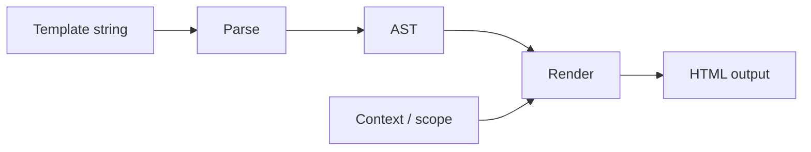

<!--
marp: true
theme: liquidjs
_header: ''
footer: '<span class="liquidjs-credit"> <strong>LiquidJS</strong></span>'
_paginate: false
-->

<div class="brand">

<h1>LiquidJS</h1>
</div>

### Building a template engine and growing an open source project

Yang Jun · [liquidjs.com](https://liquidjs.com)

---

# The question

> What happens when a small open-source project becomes software that **thousands of projects depend on**?

<!-- This talk is really three stories woven together. -->

---

# Today

1. **How a template engine works** — LiquidJS under the hood
2. **How to build a widely used library** — adoption, compatibility, DX
3. **What OSS maintenance actually looks like** — community, scale, sustainability

---

<!-- _class: lead -->

# Part 1

## How a template engine works

---

# What is Liquid?

A **logic-less** template language created for Shopify.

- Used by **Shopify**, **Jekyll**, and **GitHub Pages**
- Separates presentation from application logic
- Safe for untrusted templates — no arbitrary code execution

```liquid
Hello, {{ name | capitalize }}!
```

---

# Why LiquidJS?

**Goal:** a standard Liquid implementation for JavaScript.

- Port Jekyll sites and Shopify themes to **Node.js**
- Run in **Node.js**, **browsers**, and the **CLI**
- **Shopify / Jekyll / GitHub Pages compatible**

<!-- Started small. The bet was compatibility would matter more than novelty. -->

---

# Quick start

```js
import { Liquid } from 'liquidjs'

const engine = new Liquid()
const html = await engine.parseAndRender(
  'Hello, {{ name | capitalize }}!',
  { name: 'liquid' }
)
//=> 'Hello, Liquid!'
```

[liquidjs.com/playground.html](https://liquidjs.com/playground.html)

---

# Template → HTML pipeline



<!-- Parse once, render many times. Caching the AST is a big win. -->

---

# Parse: template → AST

**Tags** — control flow and structure

```liquid

  Welcome, {{ user.name }}

  Please sign in

```

**Filters** — transform output (`capitalize`, `date`, `json`, …)

---

# Render: AST + context → HTML

| Concept | Role |
|--------|------|
| **Context** | Variables available to the template |
| **Scope** | Nested contexts inside `for`, `capture`, … |
| **Partials & layouts** | Reusable fragments and page shells |
| **Tags & filters** | Built-in + custom extensions |

---

# Design choices

- **Compatibility first** — match Shopify / Jekyll behavior
- **Safety by default** — templates cannot run arbitrary JS
- **Extensibility** — register custom tags and filters
- **Isomorphic** — same engine in Node.js and the browser

<!-- Compatibility creates trust. Trust creates adoption. -->

---

<!-- _class: lead -->

# Part 2

## Creating a widely used library

---

# Start with a real gap

LiquidJS filled a concrete need:

- Ruby Liquid existed; **JavaScript did not**
- Teams migrating from Jekyll / GitHub Pages needed a faithful port
- Shopify theme tooling increasingly touched the JS ecosystem

**Lesson:** widely used libraries solve **migration and interoperability** pain.

---

# Compatibility as a strategy

- Follow the **reference implementation** closely
- Invest in **regression tests** against real-world templates
- Treat breaking changes as a **last resort**
- Document **differences** honestly when they exist

<!-- Users choose you because their existing templates keep working. -->

---

# Developer experience

What helped adoption:

- Clear **[documentation](https://liquidjs.com)** and tutorials
- **[Playground](https://liquidjs.com/playground.html)** for quick experiments
- **TypeScript** types out of the box
- Simple API: `parseAndRender`, partials, layouts, caching

---

# Quality guardrails

- **CI** on every change
- **High test coverage** — edge cases from Shopify & Jekyll matter
- **Semantic versioning** — predictable upgrades for dependents
- **Multiple runtimes** — Node.js, browser bundle, CLI

---

# Ecosystem adoption

LiquidJS is used across static sites, e-commerce, email, CMS, and more.

Products and teams have built on it — see the [Used by](https://github.com/harttle/liquidjs#used-by) list on GitHub.

**Takeaway:** a library grows when it becomes **infrastructure**, not just a utility.

---

<!-- _class: lead -->

# Part 3

## Building, maintaining & growing open source

---

# From side project to dependency

The shift when usage grows:

- Bug reports come from **templates you have never seen**
- Issues span **Shopify, Jekyll, and custom extensions**
- Every release can affect **thousands of downstream projects**

<!-- You are no longer optimizing for yourself — you are optimizing for an ecosystem. -->

---

# Day-to-day maintenance

- **Triage** issues and reproduce with minimal examples
- **Review PRs** — contributors often know one ecosystem deeply
- **Balance** new features vs. compatibility guarantees
- **Communicate** release notes and migration paths clearly

---

# Growing a community

- **Contribution guidelines** lower the barrier to first PR
- **Responsive maintainers** build long-term trust
- **Credit contributors** — the project outgrows any one person
- **Docs and examples** turn users into contributors

---

# Sustainability

Open source needs more than stars:

- **GitHub Sponsors** and community support
- **Corporate adopters** who benefit from stability
- **Sustainable pace** — maintenance is a marathon

[github.com/sponsors/harttle](https://github.com/sponsors/harttle)

---

# Lessons learned

1. **Compatibility** beats cleverness for infrastructure libraries
2. **Tests** are your contract with the ecosystem
3. **Documentation** is part of the product
4. **Community** scales what one maintainer cannot
5. **Small projects can become critical dependencies** — plan for that

---

# Thank you

**LiquidJS**
[liquidjs.com](https://liquidjs.com) · [github.com/harttle/liquidjs](https://github.com/harttle/liquidjs)

Questions?

<!-- Q&A. Mention playground and docs for anyone who wants to try it. -->

---


